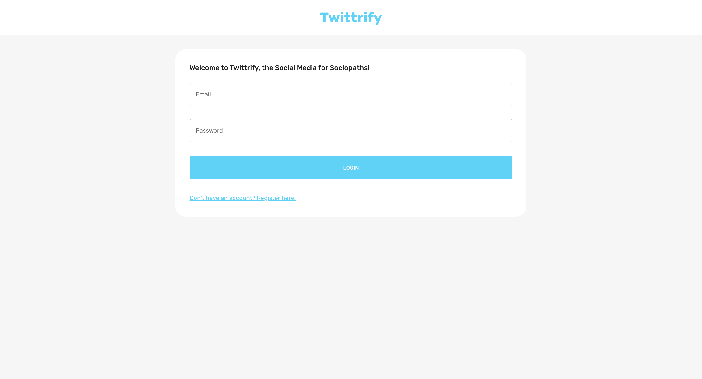
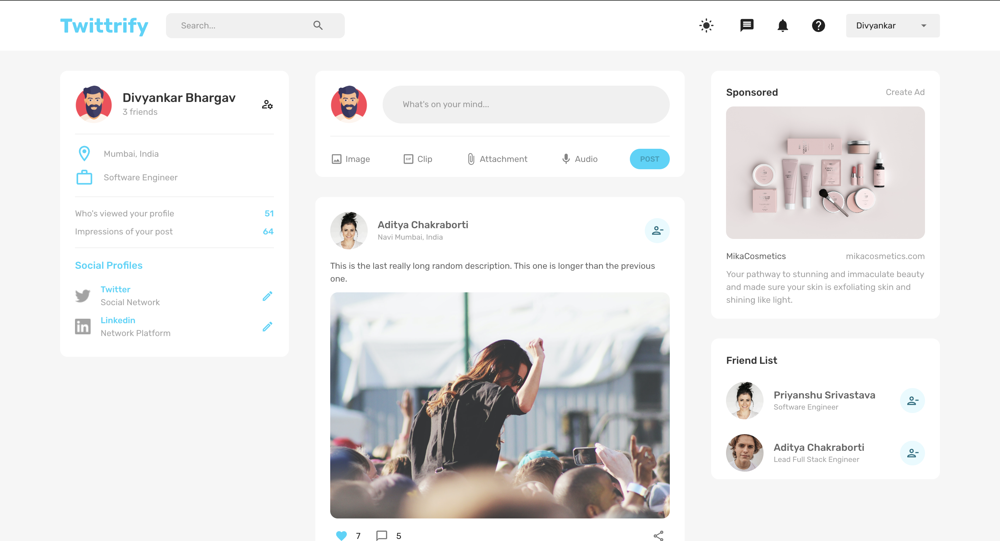
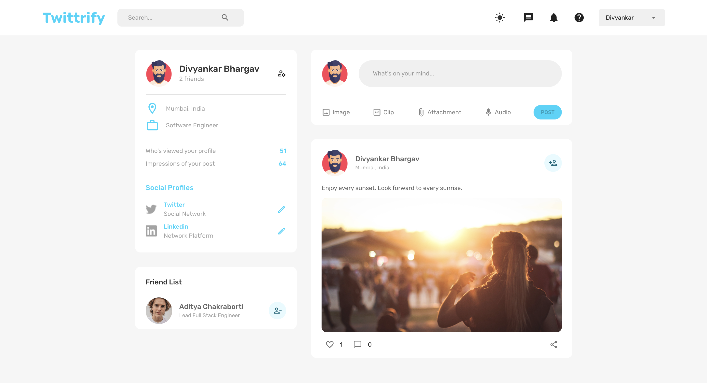
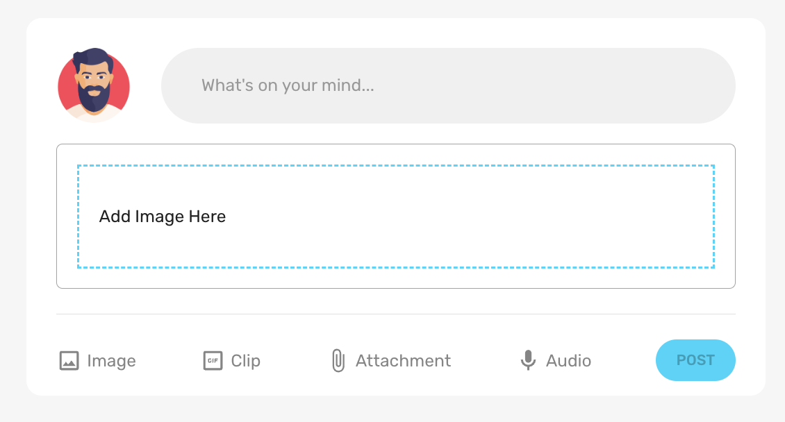

# Social Media Application - Frontend

 


This is the frontend of a social media application developed using React, Redux, Material-UI, and Formik. The frontend provides a user-friendly interface for interacting with the social media platform's features.


### Prerequisites

Before you begin, ensure you have met the following requirements:

- Node.js and npm installed
- Clone this repository


### Installation

1. Clone the repository:

```bash
git clone https://github.com/ScaryWings83289/twittrify-frontend.git
cd twittrify-frontend
```

2. Install dependencies:
```bash
yarn install
```

3. Configure environment variables (if required) or API endpoints in the .env file.

4. Start the development server:
```bash
yarn start
```

### Usage

Once the development server is running, you can access the application by navigating to `http://localhost:3000`` in your web browser. Log in or create an account to start using the social media platform.


### Features

Here are some of the key features of the frontend:

- **User Registration and Login**: Allows users to create accounts and authenticate.
- **CRUD Operations on Posts**: Users can create, read, and update posts.
- **Like Posts**: Provides functionality for users to like posts.
- **User Profiles and Friend Requests**: Users can view profiles and manage friend requests.
- **User-friendly Forms**: Implemented with validation using Formik for enhanced usability.
- **Responsive Design**: Utilizes Material-UI components for a responsive and intuitive user interface.
- **Theme Switching**: Supports both light and dark mode themes for user preference.


### Screenshots

Login Page:


Posts Page:


Profile Page:


Post Creation:



### Folder Structure

The project follows the following folder structure:

- `src/`: Contains the main source code.
    - `components/`: Reusable UI components.
    - `pages/`: Components representing application pages.
    - `store/`: Redux actions, reducers, and store configuration.
    - `styles/`: Stylesheets and theme configurations.
    - `utils/`: Utility functions and constants.
- `public/`: Contains static assets.


### Developed With

* [Visual Studio Code](https://code.visualstudio.com/) - A source code editor developed by Microsoft for Windows, Linux and macOS. It includes support for debugging, embedded Git control, syntax highlighting, intelligent code completion, snippets, and code refactoring
* [React](https://reactjs.org/) - A javascript library for building user interfaces
* [Create react app](https://create-react-app.dev/) - A quick method to start developing a react application.
* [Babel](https://babeljs.io/) - A transpiler for javascript
* [Redux](https://redux.js.org/) - Redux is an open-source JavaScript library for managing and centralizing application state.
* [Webpack](https://webpack.js.org/) - A module bundler